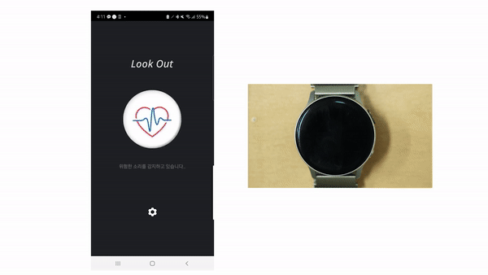
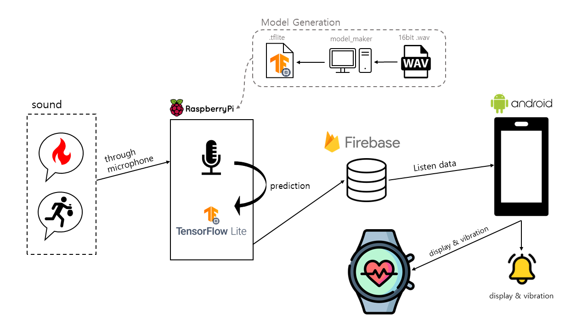

<p align="center">
  
  <br>
</p>

[](https://github.com/KOSS-LOOK-OUT)
[](https://youtu.be/cYq_--GPmiE)
# LookOut



---

### 소개
화재나 교통사고 등 위험 상황 발생 시 상황을 소리로 인지하지 못하여 피해를 보는 청각장애인들이 많습니다. 청각장애인들이 아니어도 노이즈 캔슬링 이어폰이나 시끄러운 실내에서 위험 상황을 뒤늦게 알아차리고 제대로 대처가 안되는 경우가 발생하기도 합니다. 이러한 상황에 대한 해결책으로는 주변의 소리를 인식 및 분류하여 위험 상황일 경우 사용자에게 스마트폰 알림을 주는 애플리케이션이 있습니다. 하지만 "조심해", "불이야"와 같은 말소리를 인식하여 사용자에게 정보를 제공하기 어렵다는 문제점이 있습니다. 

LookOut은 청각장애인을 위한 인공지능 음성 기반 위험 안내 어플입니다. LookOut은 라즈베리 파이를 활용하여 가정이나 실내 장소에 설치 가능한 기기를 만듭니다. 특정 음성 키워드가 인식되었을 경우 어플리케이션 서버에 감지된 키워드 정보를 전달합니다. 
사용자는 위험상황이 발생하였거나 등록되어있는 특정 음성이 인식이 되었을 경우 스마트폰과 워치를 통해 알림을 받을 수 있습니다.

인식할 수 있는 키워드로는 2022년 9월 기준 "불이야", "도둑이야", "조심해"가 있습니다.

### Tensor Flow lite model maker 모델 훈련
<tr>
<td>
    <a target="_blank" href="https://colab.research.google.com/github/tensorflow/tensorflow/blob/master/tensorflow/lite/g3doc/models/modify/model_maker/speech_recognition.ipynb">Run in Google Colab</a>
  </td>
  <td>
    <a target="_blank" href="https://github.com/tensorflow/tensorflow/blob/master/tensorflow/lite/g3doc/models/modify/model_maker/speech_recognition.ipynb">View source on GitHub</a>
  </td>
  <td>
    <a href="https://storage.googleapis.com/tensorflow_docs/tensorflow/tensorflow/lite/g3doc/models/modify/model_maker/speech_recognition.ipynb">Download notebook</a>
  </td>

</tr><br>

- **데이터 라벨링**

  저희가 참고한 Text classification with TensorFlow Lite Model Maker 예제에서 사용한 훈련데이터를 바탕으로 데이터의 포맷과 개수를 정했습니다. Tensorflow Lite Model Maker에서는 전이 학습 프로세스로 사전 훈련된 모델의 기능을 임베딩하여 사용하기 때문에 각 클래스에 수십 개의 샘플만 있으면 accuracy를 보장받는 모델을 얻을 수 있습니다.

  따라서 저희는 각 키워드별로 다양한 화자, 빠르기와 톤의 1초 미만 16bit wav 파일을 녹음하여 약 200개씩 준비하였습니다. 


## System Architecture


## 개발환경 및 개발언어
-	운영체제 : Windows, Ubuntu 20.04, Raspbian 5.15 (64bit)
-	디바이스 구성 : Raspberry Pi 4B, ReSpeaker 2-Mics Pi HAT
-	IDE : Visual Studio Code, Android Studio
-	개발 언어 : Python3.9, Java
-	데이터베이스 : Firebase realtime database
-	협업 툴 : Github, Notion, Discord


## Quick Start
### Installation

use virtual environment

- Window
```shell
$ python -m venv myenv
$ myenv/Scripts/activate
```

- Linux/Mac
```shell
$ python -m venv myenv
$ source myenv/Scripts/activate
```


install dependencies
```shell
$ git clone https://github.com/KOSS-LOOK-OUT/LookOut_Device.git
$ cd LookOut_Device
$ pip install -r requirements.txt
```

You need to create .env file in your root directory
```python
# .env

DATABASE_URL=firebase_realtime_db_url
GOOGLE_APPLICATION_CREDENTIALS=google_service_account_file_path

```

Connect device with application
```shell
$ python connect_device.py
id:  ceed1555-5cc9-476d-a167-c908dfb5c954  // your device uuid
no:  516898  // Authentication number
```

Finally, start!
```shell
$ python streaming_recognition.py
```

---
## Commit Message Convention

### Commit message 구조
Commit message 는 제목, 본문, 꼬리말로 구성합니다.
제목은 필수사항이며, 본문과 꼬리말은 선택사항입니다.
```
<type>: <subject>

<body>

<footer>
```

### Type
> - feat : 새로운 기능 추가, 기존의 기능을 요구 사항에 맞추어 수정
>
> - fix : 기능에 대한 버그 수정
>
> - build : 빌드 관련 수정
>
> - chore : 패키지 매니저 수정, 그 외 기타 수정 ex) .gitignore
>
> - ci : CI 관련 설정 수정
>
> - docs : 문서(주석) 수정
>
> - style : 코드 스타일, 포맷팅에 대한 수정
>
> - refactor : 기능의 변화가 아닌 코드 리팩터링 ex) 변수 이름 변경
>
> - test : 테스트 코드 추가/수정
>
> - release : 버전 릴리즈

---


### 팀 정보

| Name   | Email                 | Role | Part | Tech Stack |
| ------ | --------------------- | ---- | ---------- | ---------- |
| <a href="https://github.com/mrgentle1">김준영</a> | mrgentle15@gmail.com   | 팀장 | PM, device and tensorflow       | Python, tensorflow, firebase  |
| <a href="https://github.com/Eonji-sw">김언지</a> | ejkim0625@gmail.com   | 팀원 | mobile app, device       | Python, Java  |
| <a href="https://github.com/Kim-Jiyun">김지윤</a> | kwldbs1118@gmail.com  | 팀원 | mobile app core      | Java, firebase  |
| <a href="https://github.com/hummingbbird">이채영</a> | pop98149814@gmail.com | 팀원 | mobile app UI       | xml, Java  |
