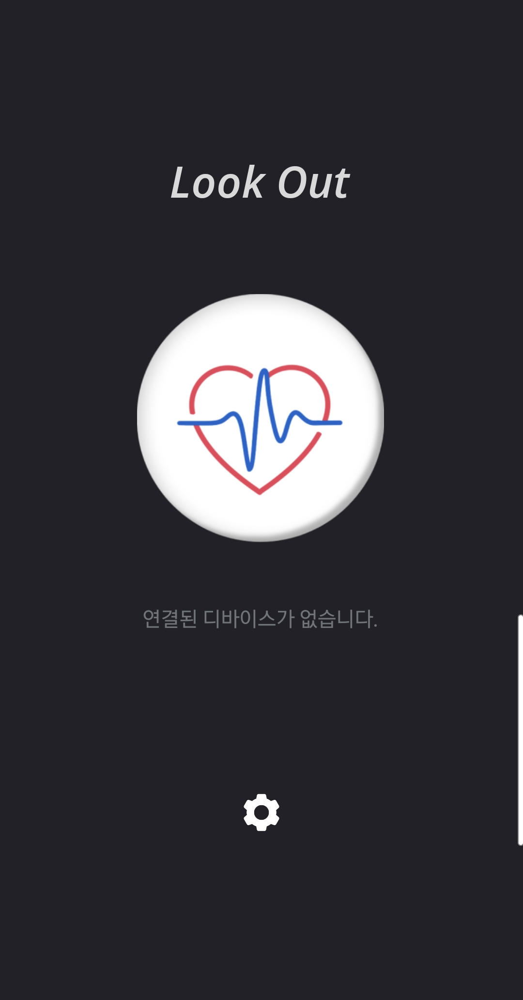
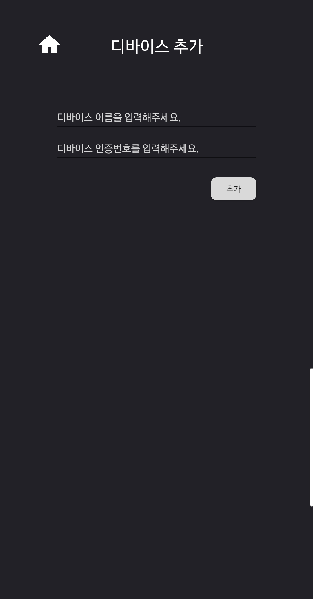

#  Look out

## 목차

- [1. 소개](#소개)
- [2. 소개 영상](#소개-영상)
- [3. 주요 기능](#주요-기능)
- [4. 개발과 개발 환경](#개발과-개발-환경)
- [5. 시스템 다이어그램](#시스템-다이어그램)
- [6. 앱 화면](#앱-화면)
- [7. 시작하기](#시작하기)
- [8. 문서](#문서)
- [9. License](#license)
- [10. 팀 정보](#팀-정보)

---

### 소개

> 청각장애인을 위한 음성 기반 위험 안내 어플

- 라즈베리 파이를 활용하여 가정이나 실내 장소에 설치 가능한 기기를 만듭니다.
- 디바이스에 특정 음성이 인식되었을 경우 어플리케이션 서버에 감지된 키워드를 전달합니다.
- 어플에 등록한 디바이스에서 키워드 감지될 경우, 사용자는 스마트폰 통해 알림을 받을 수 있습니다.

---

### 소개 영상

## [

---

### 주요 기능

> 디바이스

-
-
-

> 어플

- 비상 상황에 바로 119와 112로 전화를 걸 수 있는 기능
- 비상 상황에 문자를 보낼 수 있는 기능(1. 자신이 설정한 기본 값으로 전송, 2. 직접 입력하여 전송)
- 알림이 뜰 때 진동과 같이 울릴 수 있도록 설정하는 기능
- 알림 로그(알림이 뜬 시간과 감지한 키워드)을 직접 확인하고 지울 수 있는 기능
- 디바이스를 등록하고 삭제할 수 있는 기능

---

### 개발과 개발 환경

| Part       | Environment    | Remark(Version) |
| ---------- | -------------- | --------------- |
| App        | Android Studio | 2021.2.1        |
| App Server | Fire Base      | 7.6.15          |
| Device     | Raspbian       | 5.15(64-bit)    |

---

### Main library

| Name | Remark |
| ---- | ------ |

---

### 시스템 다이어그램

#### 전체 시스템 구성

#### 다중 연결 아키텍처

---

#### 앱 화면

1. 스플래쉬 화면  
   

---

2. 메인 화면  
   

---

3. 세팅 화면  
   

---

3-1. 문자 기본 값 화면  
 

3-2. 알림 설정 화면  
 

3-3. 디바이스 설정화면  
 

3-3-1. 디바이스 추가 화면  
 

3-4. 알림 기록 보는 화면  
 

---

4-1. 알림 화면("불이야", "조심해" -> 119)  
 

4-2. 알림 화면("도둑이야" -> 112)  
 

---

5. 문자 전송 창  
   

---

### 문서

- [here]().

---

### License

- ***

### 팀 정보

| Name   | Email                 | Role | Major Part | Minor Part | Tech Stack |
| ------ | --------------------- | ---- | ---------- | ---------- | ---------- |
| 김준영 | 메일주소              | 팀장 | 역할       | 역할       | 기술 스택  |
| 김언지 | ejkim0625@gmail.com   | 팀원 | 역할       | 역할       | 기술 스택  |
| 김지윤 | kwldbs1118@gmail.com  | 팀원 | 역할       | 역할       | 기술 스택  |
| 이채영 | pop98149814@gmail.com | 팀원 | 역할       | 역할       | 기술 스택  |
